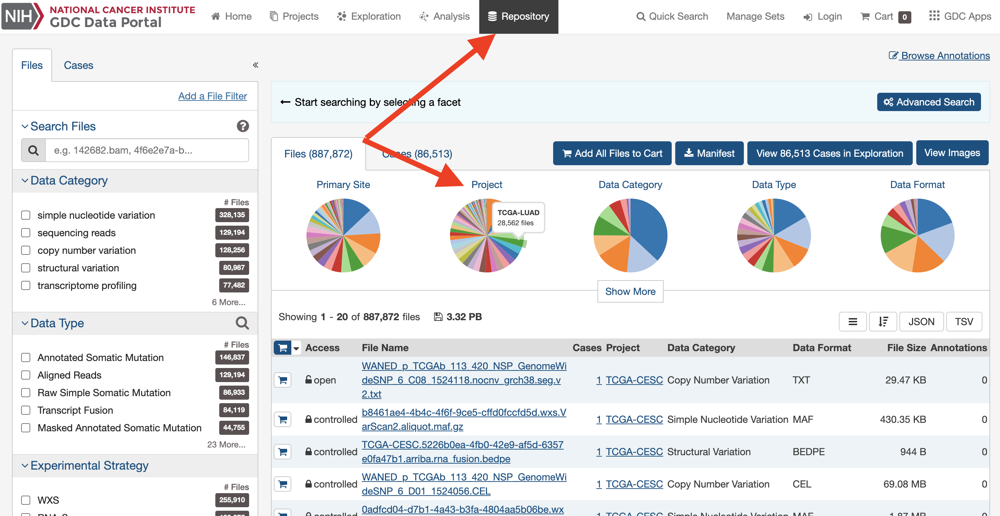
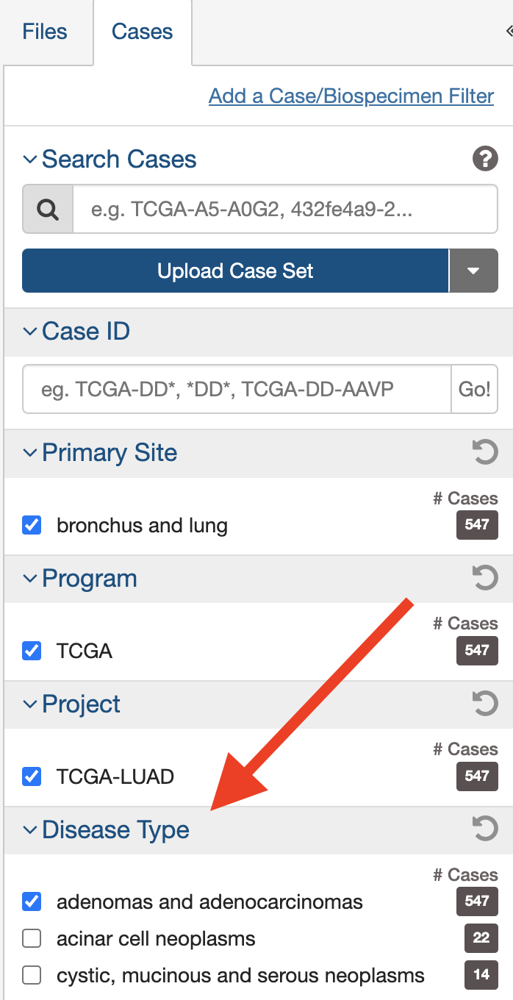
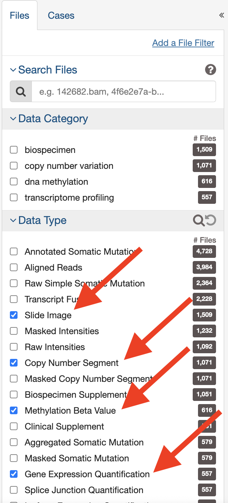
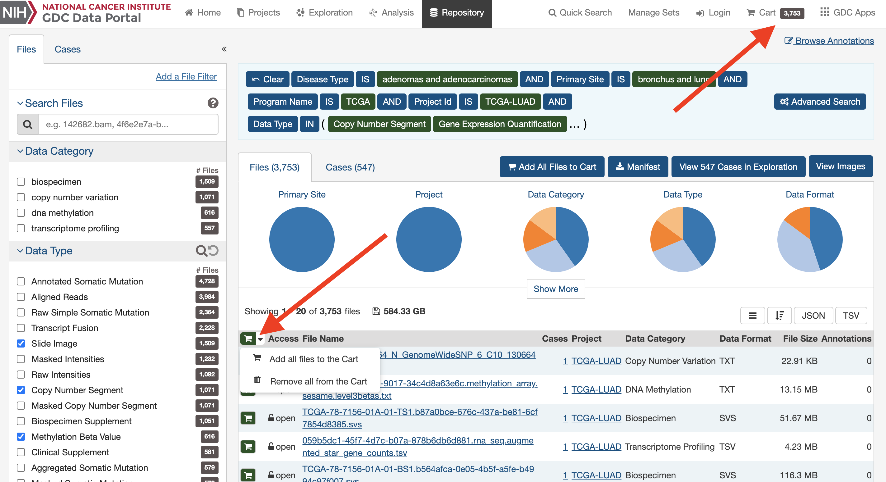
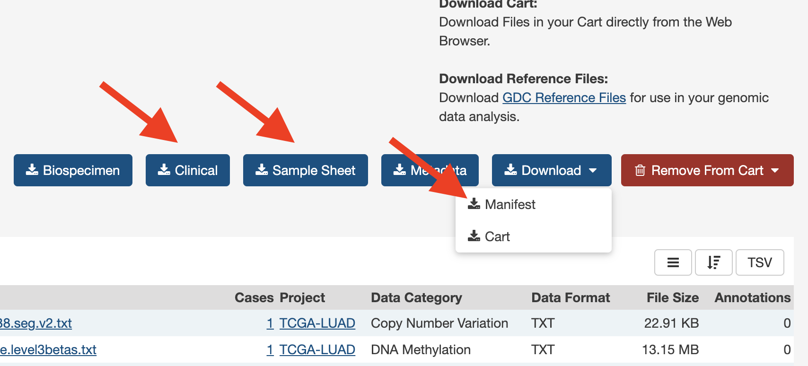

# Multiomic Deep Learning Models with TCGA Data

This project provides a preprocessing, data organization, and modeling framework to predict the survival of cancer patients using data collected from [The Cancer Genome Atlas](https://www.cancer.gov/ccg/research/genome-sequencing/tcga). The Cancer Genome Atlas provides publicly available data through the [GDC (Genomic Data Commons) Data Portal](https://portal.gdc.cancer.gov/). 

The idea of predicting survival using multiomic data extends from the paper *Integrating genomic data and pathological images to effectively predict breast cancer clinical outcome. (Dongdong Sun, Ao Li, Bo Tang, Minghui Wang).* This project also expands on the work of Sally Zhi, who worked with a glioblastoma dataset from TCGA. 


>## Table of Contents
1. [Downloading a dataset](#downloading-a-dataset)
2. [Reorganizing the data](#reorganizing-the-data)
3. [Preprocessing modalities](#preprocessing-modalities)
4. [Modeling](#modeling)
---
### Downloading a dataset
The dataset used in this study is from [TCGA's LUAD Project](https://portal.gdc.cancer.gov/projects/TCGA-LUAD). This dataset was chosen for its relatively high number of available clinical cases for analysis (~585). It also shares the same modalities used in *Sun et. al*: **Copy Number Variation, Epigenomic, Clinical, Transcriptomic, and Imaging**. These five modalities will be used for this project's analysis. Any dataset from TCGA on the GDC data portal can be downloaded and used for a similar type of analysis. To download a dataset with these five modalities, please follow these steps.
1. Navigate to the [GDC data portal](https://portal.gdc.cancer.gov/repository) and select the 'Repository' tab at the top.
2. Select a project.

3. On the left-hand menu, under the cases tab, make sure to select a specific disease for the study if multiple are present. Under the files tab, under data type, select "Slide Image," "Copy Number Segment," "Methylation Beta Value," and "Gene Expression Quantification." These correspond to the imaging, CNV, epigenomic, and transcriptomic modalities respectively. 
<p text-align="center">
  
   
</p>

4. Next, click on the small shopping cart icon and add all files to cart. Click the cart icon in the top right corner. 

5. All the relevant files should be listed in the cart now. Now, install the **Sample Sheet**, **Clinical**, and the **Manifest** files. The sample sheet is a table that maps each of the cases to the files and gives descriptions about what modality each file belongs. The clinical data has information about the patients and includes the survival data. The manifest file contains a set of file UUIDs and will be used to instruct an API to download the data we have filtered.
 
6. Next, we will pass the manifest file to the GDC Data Transfer Tool Client. [Download the tool here](https://gdc.cancer.gov/access-data/gdc-data-transfer-tool). If using Ubuntu/Linux, the executable for the tool client can be called using the following command line syntax:
```shell
# cd into the directory to download data
cd ~/<PATH TO DOWNLOAD RAW DATA>/
# go to where the gdc client is downloaded, and specify the manifest file in the final argument
/<PATH TO GDC-CLIENT>/gdc-client download -m  /<PATH TO MANIFEST FILE>/manifest_file.txt
```
7. The download should now begin!
### Reorganizing the data
The download from the data transfer tools downloads each file into its own individual folder. Using the sample sheet, we can reorganize the files so that each file belongs in a folder corresponding to the case it is associated with. We name the folders by Case ID, and each case folder has subdirectories corresponding to the modalities of study, and each of those folders contains data files.
To reorganize the data, use the script found in `data_setup/reorganize_data.py`. The script takes in three arguments:
1. origin_path, the path to the original folder containing the data retrieved from the data client
2. sample_sheet_path, the path to the sample sheet downloaded earlier
3. destination_path, the path to where to store the reorganized data by cases
```sh
python3 -u reorganize_data.py ${1} ${2} ${3}
```
### Preprocessing modalities
The repository contains preprocessing for the five modalities aforementioned. Details about the preprocessing can be found in Jupyter notebooks found in `preprocessing/`. Running each of the notebooks should prepare a set of csv files that joins data by case across each of the modalities. 
After the notebooks are run, a train-test split can be created. Generally the number of cases that are used for the final analysis are reduced because some cases may lack data from one or more of the modalities. As a result, it is important to create a split once all the filtering has been completed. The notebook found in `preprocessing/training_test_split.ipynb` generates a split for the data and saves a list of training and testing case IDs. The python file `preprocessing/merging_train_test_split.py` can also be used. 

### Modeling